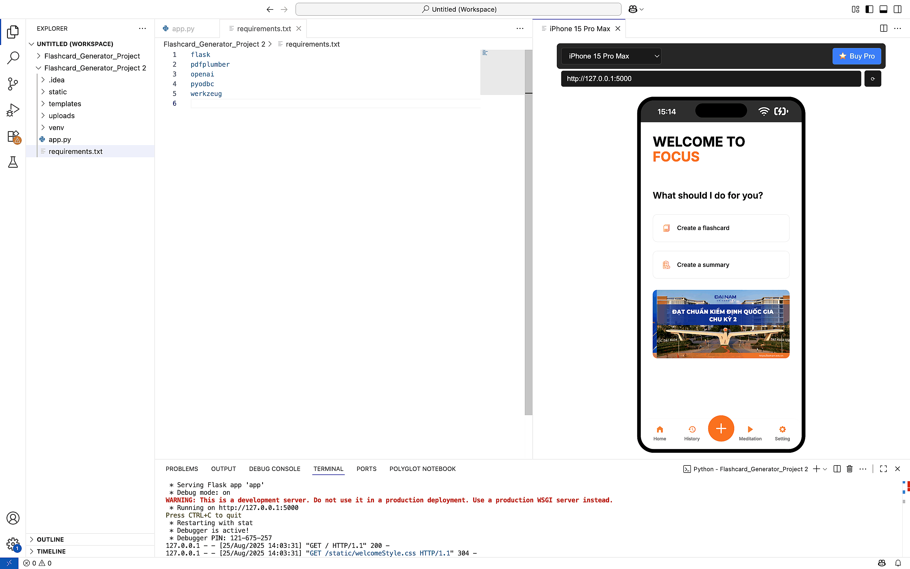

# Tổng Quan Dự Án
"Focus" là một dự án kết thúc học phần của môn học "Nhập môn Chuyển đổi số" do nhóm sinh viên Khoa Công nghệ Thông tin, Trường Đại học Đại Nam phát triển. Dựa trên nền tảng ứng dụng di động, dự án hướng tới việc hỗ trợ sinh viên trong quá trình học tập thông qua tính năng tạo flashcard thông minh. Ứng dụng khai thác mô hình GPT-3.5 của OpenAI để tự động phân tích tài liệu PDF và sinh ra các cặp câu hỏi – trả lời, giúp người học dễ dàng hệ thống kiến thức và nâng cao khả năng ghi nhớ.

Ngoài ra, hệ thống còn tích hợp cơ sở dữ liệu SQL để lưu trữ và quản lý flashcard, mang lại trải nghiệm ổn định và cá nhân hóa cho từng người dùng. Với giao diện thân thiện trên nền tảng di động, "Focus" không chỉ là một công cụ ôn tập hiệu quả mà còn là minh chứng cho việc ứng dụng công nghệ chuyển đổi số vào giáo dục.

# 👻 Chuẩn Bị Cài Đặt
1. OpenAI API Key, thay thế vào đoạn mã sau trong app.py:
<pre> ```client = OpenAI(api_key=“your-API-Key”)``` </pre>
3. Tạo database theo câu lệnh:
<pre> ```CREATE DATABASE flashcardGeneratorDB;``` </pre>
5. Cài đặt các thư viện:
<pre> ```pip install -r requirements.txt``` </pre> 
7. Chạy chương trình qua Terminal
<pre> ```Python3 app.py``` </pre> 

# 🚀 Hướng Phát Triển
- Bổ sung chức năng tóm tắt nội dung văn bản, giúp người dùng nhanh chóng nắm bắt ý chính.
- Tích hợp chức năng phát nhạc và thiền định, hỗ trợ tạo không gian học tập thoải mái, giảm căng thẳng.
- Xây dựng hệ thống tài khoản đăng nhập, nhằm cá nhân hóa trải nghiệm và đồng bộ dữ liệu người dùng trên nhiều thiết bị.

# 🖼️ Preview


# 👨‍💻 Thành viên tham gia dự án
1. Trần Minh Nghĩa - CNTT 1704 - MSV: 1771020505.
2. Lương Đức Thành - CNTT 1704 - MSV: 1771020631.
3. Nguyễn Thị Hương Giang - CNTT 1704 - MSV: 1771020221.
